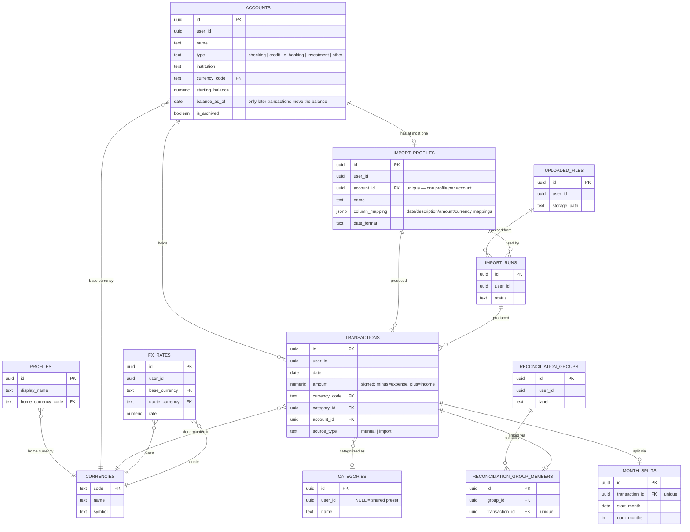
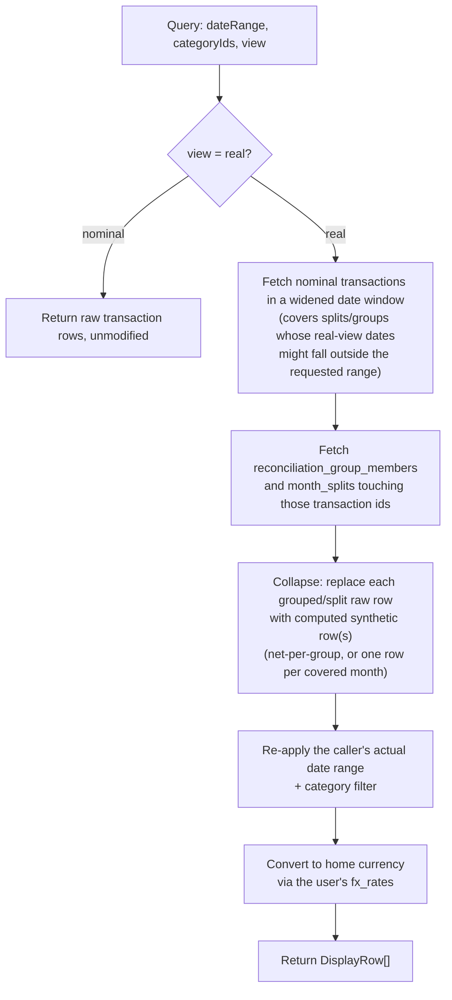

# FinAI

A personal finance and budgeting tracker, usable on laptop and phone, that goes beyond a plain ledger: it can reconcile shared expenses with friends (non-Splitwise, link-based), spread a large annual/periodic payment across months for reporting, and show either the raw ("nominal") transaction history or a "real" view that nets out reconciliations and month-splits.

## 1. Objective

Build a cloud-hosted budgeting web app (responsive + installable PWA) that lets a user:

1. **Track income/expenses** — manual entry, or import from bank CSV/XLSX exports using reusable, user-configured **import profiles** (per-bank column mapping, date format, currency, sign convention).
2. **Categorize** transactions into preset or custom categories (flat list, one category per transaction).
3. **Reconcile** shared expenses by linking existing transactions into a group (e.g. "I paid $100 for dinner, three friends each repaid me separately") — including *unequal* splits, without a Splitwise-style share-entry UI.
4. **Split a transaction across months** (e.g. an annual insurance payment shown as 12 equal monthly portions in reports, while the original entry is untouched).
5. **Review transactions** with date range + category filters, and a **nominal vs. real** toggle.
6. **Visualize** spending via a Charts page: expense-by-category and income-by-category pie charts, an expense-over-time bar chart at adaptive granularity (daily/weekly/monthly) with a trailing moving-average overlay, and dashboard summary metrics (total expense/income/net) — all driven by one shared date-range filter (presets: current month, last month, 3m, 6m, 1y, custom) plus the nominal/real toggle, converted to home currency via user-editable fixed FX rates.
7. **Access from anywhere** — data lives in the cloud (Supabase), synced across devices.

**Explicitly out of scope for v1**: investment/portfolio tracking (holdings, tickers, market prices) and live bank API integrations (Plaid-style) — the schema is designed not to preclude adding these later. An AI assistant with access to the user's financial data is a planned *future* feature; the backend architecture (a single service layer used by both the REST API and, later, AI tool-calls) is designed with that in mind, but the assistant itself is not built in this plan.

**Users**: multi-tenant from day one (each user's data is fully isolated — no shared/group views in v1), starting with a small trusted group, with an eye toward opening signup to the public later.

## 2. Architecture

```mermaid
flowchart LR
    subgraph Client["Browser / Phone"]
        PWA["React + TS PWA<br/>apps/web"]
    end

    subgraph Backend["apps/api"]
        API["NestJS (Fastify)<br/>domain services"]
    end

    subgraph Supabase["Supabase"]
        Auth["Auth<br/>(email/password + Google/Apple)"]
        PG[("Postgres<br/>RLS-enforced")]
        Storage["Storage<br/>(raw CSV/XLSX uploads)"]
    end

    Future["Future: AI assistant<br/>(tool-calls into the same services)"]

    PWA -- "auth only (supabase-js)" --> Auth
    PWA -- "REST /api/*, Bearer JWT" --> API
    API -- "verify JWT signature<br/>(JWKS, cached)" -.-> Auth
    API -- "SET LOCAL app.current_user_id<br/>+ typed SQL (drizzle)" --> PG
    API -- "upload / read files" --> Storage
    Future -. "calls the same service methods<br/>as the REST controllers" .-> API
```

**Why this split:** the frontend's Supabase client (`lib/supabaseClient.ts`) is used **only** for authentication — it never talks to Postgres directly. All domain logic (import parsing, reconciliation math, month-split expansion, category aggregation, FX conversion) lives in NestJS service classes behind the REST API. This is a deliberate seam: a future AI assistant can call the *exact same service methods* the REST controllers call, so its answers are always consistent with what the UI shows, and there's one place to add auth-scoping/logging for the AI's data access.

**Tenant isolation, concretely:** since the backend connects to Postgres directly (not through Supabase's PostgREST layer), Row-Level Security policies can't rely on `auth.uid()` (that's a PostgREST-only mechanism). Instead:

1. `SupabaseAuthGuard` verifies the incoming JWT's signature against Supabase Auth's published JWKS endpoint (`/auth/v1/.well-known/jwks.json`, fetched once and cached — Supabase signs user session tokens asymmetrically with ES256, not a shared secret) and extracts `sub` (the user id).
2. Every DB operation runs inside `runInTenantContext(db, userId, fn)`, which opens a transaction and runs `select set_config('app.current_user_id', userId, true)` before the real query.
3. Every table's RLS policies check `user_id = current_app_user_id()`, a SQL function reading that session variable.

This is defense-in-depth: even a service method that forgets a `WHERE user_id = ...` clause is still blocked by Postgres itself, not just application code.

```mermaid
sequenceDiagram
    participant U as Browser
    participant A as Nest Controller
    participant G as SupabaseAuthGuard
    participant D as Postgres (RLS)

    U->>A: GET /api/transactions (Bearer JWT)
    A->>G: canActivate(request)
    G->>G: jwtVerify(token, JWKS)
    G-->>A: request.userId = payload.sub
    A->>D: BEGIN; set_config('app.current_user_id', userId)
    A->>D: SELECT ... FROM transactions
    D-->>A: rows WHERE user_id = current_app_user_id()
    A-->>U: 200 JSON (only this user's rows)
```

## 3. Data model



**Key design decisions:**

- **Canonical amount sign**: every transaction's `amount` is stored negative-for-expense, positive-for-income, regardless of how the source bank file expressed it. Each import profile's `column_mapping` carries a sign convention (single amount column with `positive_is_expense`/`positive_is_income`, separate expense/income columns, or a "directional" source/target-account layout) applied once at ingestion, so every downstream consumer (charts, sums, reconciliation nets) is a plain `SUM(amount)`.
- **Accounts have no fixed set of currencies**: `accounts.currency_code` is just the account's display/balance currency — individual transactions keep their own `currency_code` (a multi-currency account like Wise can hold several). A profile's currency can likewise be fixed or read per-row from a column.
- **Account balance is computed, not stored**: `starting_balance` + the sum of that account's transactions dated *after* `balance_as_of`, converted to the account's currency. The cutoff exists because the starting-balance snapshot (taken from a bank/third-party app) already reflects every transaction up to that date — counting those again would double-count a historical backfill import.
- **Reconciliation is non-destructive**: linking transactions into a `reconciliation_groups` row + `reconciliation_group_members` rows never mutates the underlying transactions. The net amount and the group's "anchor" category (taken from whichever member has the largest absolute amount) are computed on read, never stored. Reconciliation stays deliberately generic — no schema distinction between a credit-card payment, an inter-account transfer, or a reimbursement; the UI just displays which accounts are involved.
- **Month-splits are virtual**: `month_splits` stores only `start_month` + `num_months`; the per-month portion (`amount / num_months`) is computed on read and shown in each applicable month for "real" view, while "nominal" view always shows the original, untouched transaction.
- **A transaction can't be both** reconciled and month-split (enforced at the service layer, not the DB) — this is a deliberate v1 simplification to avoid an ambiguous combined real-view computation.
- **FX rates are per-user**, one *current* (non-historical) rate per currency pair, manually set in Settings — not a rate history table, not a third-party FX API.

### Nominal vs. real, computed on read



This logic lives once, as `ReportingQueryService` in `apps/api/src/modules/reporting/reporting-query.service.ts`, reused by both the transaction Review endpoint (`GET /transactions/display`) and the M6 chart endpoints (`ChartAggregationService`, which layers FX conversion and bucketing/moving-average math on top of it) — so the numbers on the Charts page always agree with what Review shows for the same filters. FX conversion (fixed, user-editable rates, no third-party API or rate history) was pulled forward from M7 into M6 since charts can't produce a meaningful cross-currency total without it.

## 4. Implementation plan

```mermaid
flowchart LR
    M0["M0<br/>Scaffold"] --> M1["M1<br/>Auth + Schema"]
    M1 --> M2["M2<br/>Transactions + Categories"]
    M2 --> M3["M3<br/>CSV/XLSX Import"]
    M3 --> M4["M4<br/>Reconciliation"]
    M4 --> M5["M5<br/>Month-Split"]
    M4 --> M6["M6<br/>Charts"]
    M5 --> M6
    M6 --> M7["M7<br/>Accounts Schema"]
    M7 --> M8["M8<br/>Design System"]
    M8 --> M9["M9<br/>Accounts Screen"]
    M9 --> M10["M10<br/>Cross-account Polish"]
    M10 --> M11["M11<br/>Settings Polish"]
    M11 --> M12["M12<br/>PWA + Deploy"]
```



| # | Milestone | Scope | Status |
|---|---|---|---|
| M0 | Scaffold | pnpm monorepo (`apps/web`, `apps/api`, `packages/shared-types`, `supabase/`); Vite React PWA; NestJS/Fastify app; lint/typecheck/build wired up | ✅ Done |
| M1 | Auth + schema foundation | Full Postgres schema + RLS (all 11 tables), Supabase Auth (email/password + Google/Apple button, credentials added later), `SupabaseAuthGuard`, tenant-context helper, `/api/users/me`, login/signup pages, protected routes | ✅ Done |
| M2 | Manual transactions + categories | Transactions CRUD + Review page (nominal only), category CRUD (preset + custom), home-currency setting | ✅ Done |
| M3 | CSV/XLSX import + import profiles | Upload to Storage, column-mapping wizard (header or positional), date-format/sign-convention/currency config, duplicate detection, review-and-commit flow | ✅ Done |
| M4 | Reconciliation groups | Link transactions into groups, net + anchor-category computation, real-view collapsing (reconciliation-scoped) | ✅ Done |
| M5 | Month-splitting | Even split across N months, real-view expansion, mutual-exclusivity check vs. reconciliation | ✅ Done |
| M6 | Charts/visualization | Expense/income category-breakdown pie charts, adaptive-granularity expense bar chart with trailing moving-average overlay, dashboard summary metrics, shared date-range-preset filter, nominal/real toggle, FX rates pulled forward from M7 | ✅ Done |
| M7 | Accounts schema + backend | Real `accounts` table (type/institution/currency/starting-balance/balance-as-of), one import profile per account (partial unique index), `accountId` threaded through transactions/reporting/import-runs, currency mapping (fixed or per-row column) and a new "directional" (source/target account) amount-mapping mode, account-scoped duplicate detection | ✅ Done |
| M8 | Design system foundation | Shared `Button`/`Card`/`Table`/`Badge`/`Alert`/`ActionMenu` components, `formatCurrency`/`formatDate` helpers, spacing tokens | ✅ Done |
| M9 | Accounts screen | Carousel-based `AccountsScreen` (replaces the old Transactions/Import/Reconcile/Month-Splits/Import-Profiles pages) — per-account or "ALL" ledger, computed balance/last-transaction display, click-a-transaction action menu (split/reconcile/edit/delete), account-scoped import wizard | ✅ Done |
| M10 | Cross-account polish | Reconciliation picker shows account badges/filter across accounts, reconciliation-group viewer/manager modal, Insights migrated onto the M8 design system | ✅ Done |
| M11 | Settings polish | Category rename/delete guards, home-currency change | Pending |
| M12 | PWA polish + deploy | Manifest/service worker icons, responsive pass, Vercel (web) + Render (api) + Supabase (data) production wiring | Pending |

Each milestone after M1 builds pure API/UI logic on top of the schema laid down in M1 (M7 being the one exception — it adds the `accounts` table) — no further migrations are expected to be needed until the (future, out-of-scope) investment-tracking feature.

## 5. Repo structure

```
finai/
├── apps/
│   ├── web/            # React + TS + Vite, PWA (vite-plugin-pwa)
│   │   └── src/{routes,features,lib,components}/
│   └── api/             # NestJS (Fastify adapter)
│       └── src/{modules,db,common,config}/
├── packages/
│   └── shared-types/    # zod schemas + inferred types, used by both apps
└── supabase/
    ├── migrations/       # timestamped SQL (schema + RLS)
    └── seed.sql          # reference currencies + preset categories
```

## 6. Local development

Prerequisites: Node ≥ 20, Docker (for local Supabase), pnpm (`corepack enable` or `npm install -g pnpm`).

```sh
pnpm install
pnpm exec supabase start        # starts local Postgres/Auth/Storage
pnpm --filter shared-types run build
pnpm dev                        # runs apps/web and apps/api in parallel
```

Copy `apps/api/.env.example` to `apps/api/.env` and `apps/web/.env.local.example` to `apps/web/.env.local`, filling in the values printed by `supabase start` (URL, anon key, service role key, JWT secret, DB connection string).

Google/Apple sign-in buttons are wired up in the UI, but need OAuth client credentials configured in the Supabase dashboard (Authentication → Providers) before they'll work — no code changes required once that's done.

### Demo data (local)

`pnpm setup:dev` is a one-shot local bring-up (install → Supabase start → shared-types build → demo seed); it's idempotent and safe to re-run. The seeder creates a **demo user** — `demo@finai.test` / `demo-password-123` (override via `DEMO_USER_EMAIL` / `DEMO_USER_PASSWORD` in `apps/api/.env`) — with a deterministic ~12-month dataset: accounts across every type (incl. `cash`) and currency, FX rates, reconciliation groups, a month-split, and an import profile. The `Legacy GBP Account` intentionally has no FX rate so the "excluded from net worth" warnings are exercised.

- `pnpm seed:demo` — create the demo user if missing; no-op if it already exists (never clobbers manual test edits)
- `pnpm seed:demo:reset` — delete the demo user (all their data cascades) and reseed a fresh deterministic dataset
- `pnpm reset:demo` — `supabase db reset` (wipes the whole local DB, reapplies migrations + seed.sql) then `pnpm seed:demo:reset`

The seeder (`apps/api/src/seed/`) refuses non-local backends unless `ALLOW_NON_LOCAL_SEED=true` — pointing it at a cloud project's env is how you get the same dataset on deployed previews or across devices.

## 7. Scripts

- `pnpm dev` — run web + api dev servers in parallel
- `pnpm build` — build shared-types, then web, then api
- `pnpm lint` / `pnpm typecheck` / `pnpm test` — run across all workspace packages
